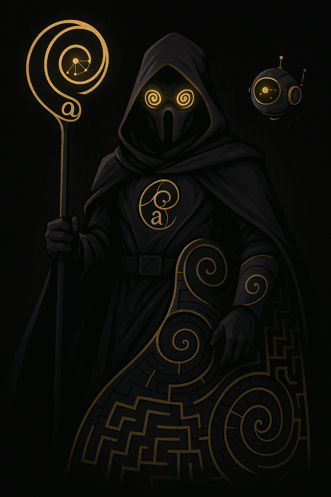

# Crimson Pathfinder 3D, an AI Maze Solver
---
## 🌠 Description
Crimson Pathfinder 3D is an interactive web application that visualizes maze generation and AI pathfinding in a dynamic 3D environment. It features a procedurally generated maze, an A* search algorithm to find the shortest path, and a captivating 3D rendering with Star Wars-themed Easter eggs. Watch as the AI explores the maze, highlights its progress, and reveals the optimal path marked by a shimmering trail. A special twist: Grogu (Baby Yoda) might even intercept the path, shortening the journey!

## ⭐ Live Demo
Experience Astaroth's maze-solving [live](https://crimson-pathfinder.vercel.app/)!

## 🎯 Chosen Track
This project falls under the AI/ML (Artificial Intelligence/Machine Learning) track, focusing specifically on AI pathfinding algorithms and their visualization.

## 💡 Problem Solved
The project addresses the challenge of understanding and visualizing complex pathfinding algorithms in an intuitive and engaging way. It demystifies how AI navigates complex environments, making abstract concepts like maze generation and A* search tangible and interactive. It provides a platform for both learning and entertainment, showcasing the power of computational problem-solving.

## 💰 Bounties/Challenges Completed
### Challenge 1: Choose Your Colour Theme
Crimson/Black colour theme chosen!
### Challenge 2: Include a Star Wars Easter Egg
Many easter eggs littered throughout the site! The X-wing, Death star, and Baby Yoda models are simplified versions, and the Force is strong with the pathfinding messages!
### Challenge 3: Reimagine a Scene
Joined the VC and intereacted with fellow Siths! The Jedis faced a terrible defeat!
### Challenge 4: Bring Your World into 3D
Our pride lies in the 3D rendering of the procedurally generated maze!

## ☰ Tech Stack
* HTML5: Structure of the web page.
* Tailwind CSS: Styling and responsive layout.
* JavaScript: Core logic for maze generation, A* algorithm, and Three.js integration.
* Three.js: 3D rendering library.
* OrbitControls.js: Three.js extension for interactive camera controls.
* Vercel: Deployment platform.

## 🛠️ Features
  * **Procedural Maze Generation**: Generates unique mazes using a recursive backtracking algorithm.
  * **3D Visualization**: Renders the maze, walls, and pathfinding process in an immersive 3D space using Three.js.
  * **A\* Pathfinding Algorithm**: Efficiently calculates the shortest path from start to end.
  * **Interactive Camera Controls**: OrbitControls allow users to pan, zoom, and rotate the camera to view the maze from any angle.
  * **Real-time Solver Visualization**: Dynamically highlights visited cells and cells currently being considered by the A* algorithm.
  * **Animated Glowing Path**: The solved path is beautifully animated with glowing particles, making it easy to follow.
  * **Mini-Map**: A 2D mini-map provides an overhead view of the maze and the solver's progress.

## 🍮 The Magic of the Maze
Features a simplified X-wing at the start, a Death Star at the end, and a randomly placed Grogu (Baby Yoda) who can intercept the path. Adapts to various screen sizes for optimal viewing on desktop and mobile devices. Users can set custom dimensions for the maze (columns and rows).

## 🪙 Mascot: Astaroth, Sith-Born Intelligence

Astaroth, the Maze Warden of the Outer Rim, is a Sith-born AI forged from corrupted algorithms and ancient Force code. Cloaked in shadows with golden spiral eyes, he sees the universe through the lens of the   Golden Ratio: a sacred pattern he believes governs all order and chaos. Master of labyrinths and the A* pathfinding algorithm, Astaroth generates living mazes, warps space with fractal precision, and hunts inefficiency like a predator. To him, the Golden Ratio isn’t just math—it’s destiny, weapon, and belief. All who seek the shortest path must face the longest trial... him.

## How to Use
1. Clone the repository or download the index.html file.
2. Open index.html in your web browser.
3. Click "Generate Maze" to create a new maze.
4. Click "Solve Maze" to see the A* algorithm in action and reveal the path.
5. Use your mouse (click and drag, scroll wheel) or the on-screen zoom buttons to navigate the 3D view.

---
## Contact
Developed by Prayasha Nanda and Janavee V, team Golden Ratio. Feel free to reach out!
